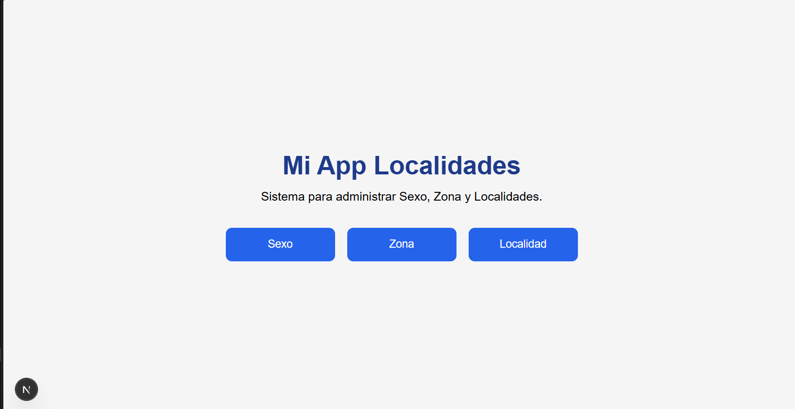
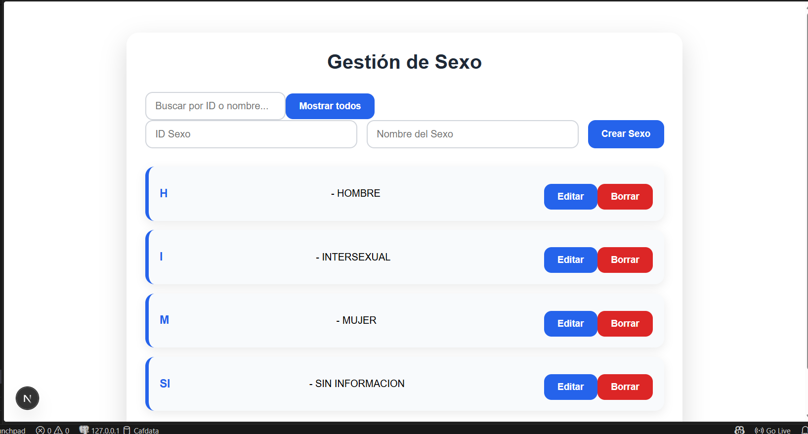
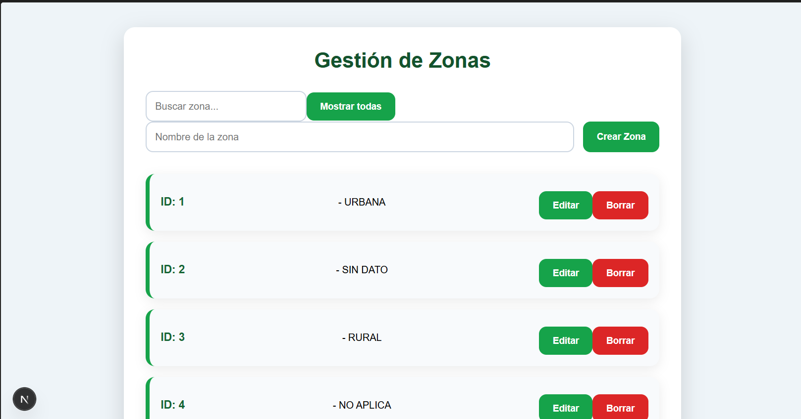
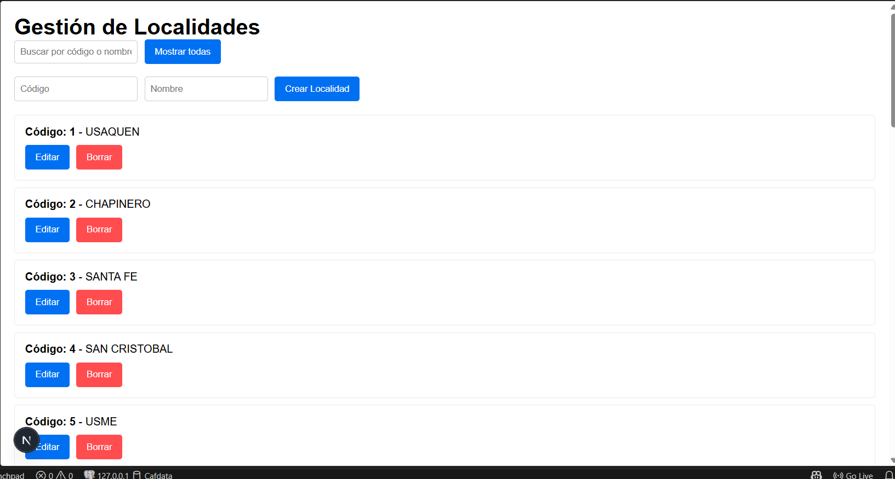
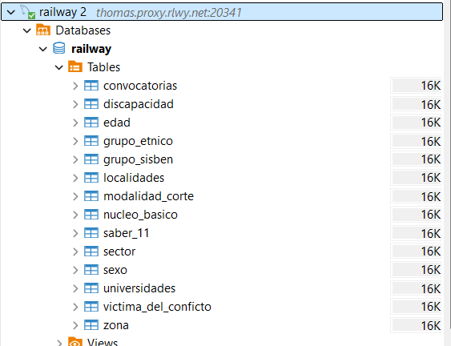

# Mi App Localidades

## Descripción

Mi App Localidades es una aplicación web desarrollada con Next.js que permite administrar la información de una base de datos mediante operaciones CRUD (Crear, Consultar, Actualizar y Eliminar).

El sistema cuenta con una página principal desde donde el usuario puede acceder a los diferentes módulos del proyecto para gestionar la información de manera sencilla e intuitiva.

## Tecnologías utilizadas

- Next.js
- React
- JavaScript
- CSS Modules
- Node.js
- MySQL
- Express.js

## Funcionalidades

- Página principal (Portada).
- Gestión de Sexo.
- Gestión de Zona.
- Gestión de Localidad.
- Operaciones CRUD completas.
- Consumo de API REST.
- Interfaz amigable para el usuario.

## Estructura del proyecto

```
app/
│
├── page.tsx
├── sexo/
├── zona/
├── localidad/
├── globals.css
└── style.module.css
```

## Instalación

Clonar el repositorio

```bash
git clone https://github.com/SebasAlfa/MI-APP-LOCALIDADES.git
```

Ingresar al proyecto

```bash
cd MI-APP-LOCALIDADES
```

Instalar dependencias

```bash
npm install
```

Ejecutar el proyecto

```bash
npm run dev
```

Abrir en el navegador

```
http://localhost:3000
```

## Autor

Jhoan Sebastián Alfaro Robayo

## Licencia

Proyecto desarrollado con fines académicos.

## Capturas del proyecto

### Página principal



### CRUD Sexo



### CRUD Zona



### CRUD Localidad



### Base de datos



## Conclusión

Este proyecto permitió implementar una aplicación web completa utilizando tecnologías modernas para el desarrollo frontend y backend, integrando una base de datos relacional y aplicando operaciones CRUD mediante una API REST.